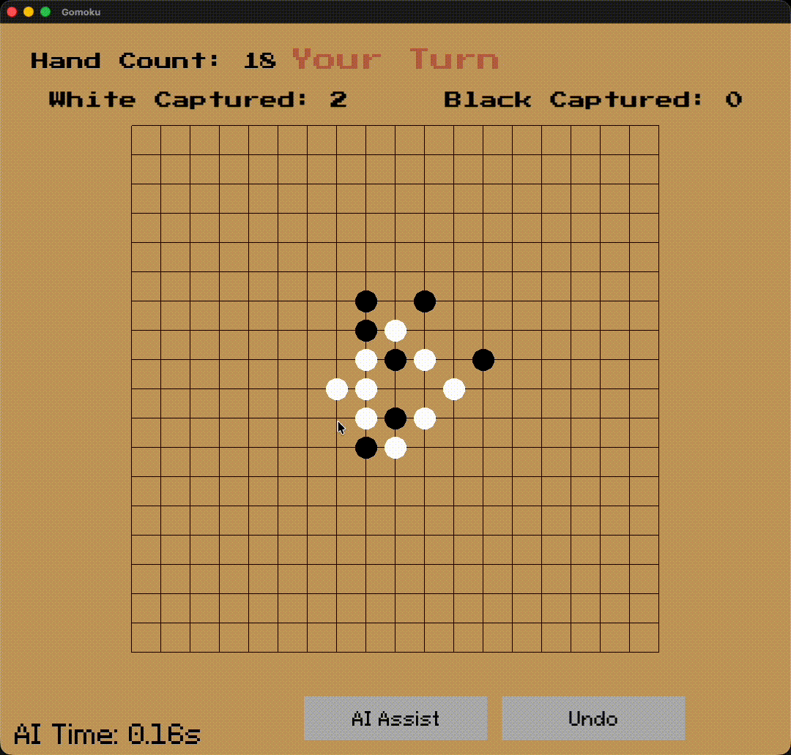
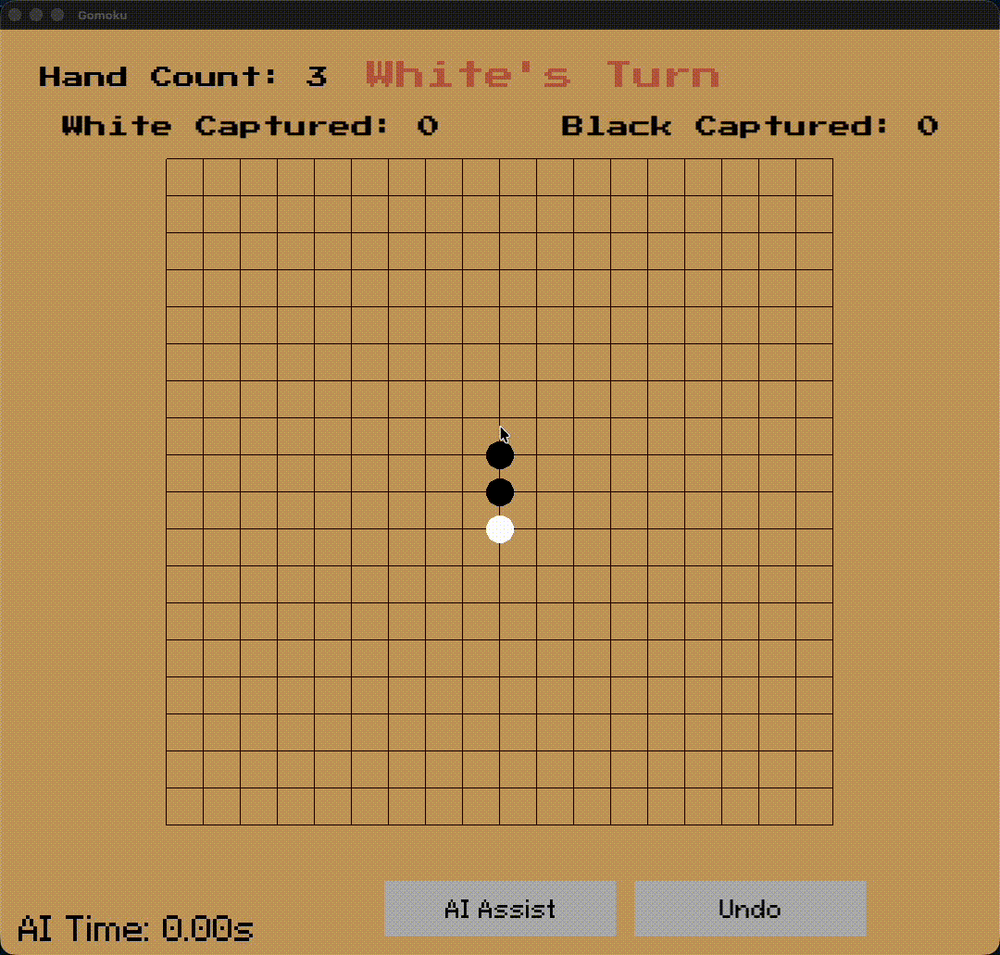
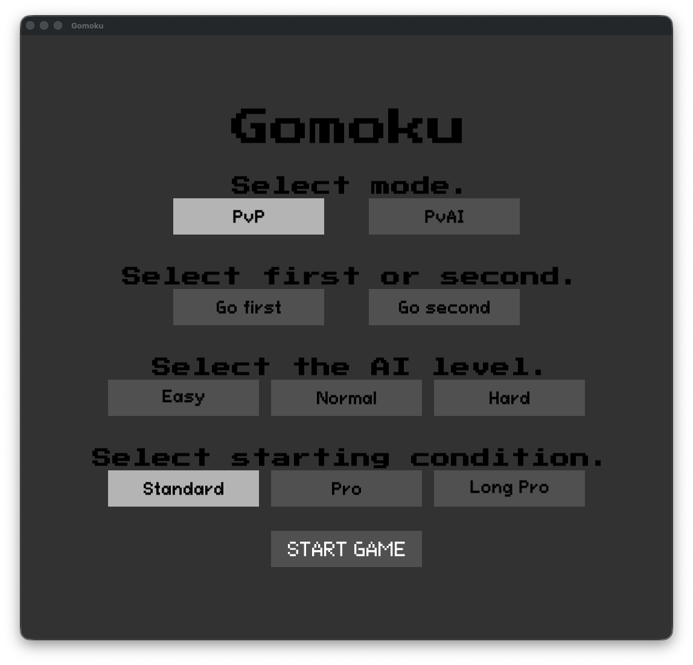

<div align="center">

# 🧠 Gomoku - High-Performance AI Engine


<br />

<br />

<p align="center">
  <strong>A highly optimized Gomoku AI capable of beating human players.</strong><br>
  Features 32-bit aligned BitBoards, Principal Variation Search (PVS), and Iterative Deepening.
</p>

[Report Bug](https://github.com/jaytakahashii/42_Gomoku/issues) · [Request Feature](https://github.com/jaytakahashii/42_Gomoku/issues)

</div>

---

## 📒 Introduction

This project is a C++ implementation of the strategy board game **Gomoku** (Five in a Row), developed as part of the curriculum at **42 Paris**.

The primary focus of this project is to build a highly optimized **AI engine** capable of beating human players within strict time constraints (avg. 0.5s/move). The game features a polished, retro-style GUI built with **SFML**, supporting custom rules such as _Capture_ and _Double-Three Forbidden_.

### 🤝 Collaboration

This project was a collaborative effort:

- **AI & Game Logic**: [Jay Takahashi](https://github.com/jaytakahashii) - Implemented the BitBoard engine, Minimax algorithm, and Heuristics.
- **UI & Graphics**: [Koji Watanabe](https://github.com/kojilbj) - Designed and implemented the SFML-based interface, Scene management, and visual effects.

---

## 🚀 Technical Highlights

The AI is built for speed and accuracy, leveraging low-level optimizations and advanced search algorithms.

### ⚡ 1. Optimization & Data Structure

- **32-bit Aligned BitBoards**: The 19x19 board is padded to a width of 32 bits. This alignment allows for **branchless boundary checks** using sentinel bits.
- **Bitwise Pattern Detection**: Line detection (5-in-a-row, open-4, etc.) and "Double-Three" validation are performed using SIMD-like bitwise operations (AND, SHIFT) instead of slow loop-based scanning.
- **Incremental Updates**: Uses **Zobrist Hashing** with XOR operations to update the board hash in $O(1)$ time during moves and undos.

### 🧠 2. Search Engine

- **PVS (Principal Variation Search)**: An enhancement of Alpha-Beta pruning. It searches the first move with a full window and assumes subsequent moves are inferior (Null Window Search), significantly reducing the search space.
- **Iterative Deepening**: Searches are performed at depth 1, 2, ... $N$. This is an investment to enable **Move Ordering**.
- **Transposition Table**: Caches board states and their evaluation scores. It serves two purposes:
  1.  **Exact Cutoff**: Returns the stored score immediately if the position was already solved.
  2.  **Move Ordering**: Retrieves the "Best Move" from previous shallow searches to sort the move list, maximizing pruning efficiency.

### 🛡️ 3. Heuristic Evaluation

The evaluator prioritizes "Unbreakable" wins and defensive stability:

- **Safety Filtering**: The AI identifies "Dead Stones" (stones that will be captured next turn) and excludes them from pattern formation. It does not chase "fake" wins.
- **Defensive Bias**: The opponent's potential score is weighted heavily (x1.2). This makes the AI "paranoid" and prioritizes blocking threats over creating equal threats.
- **Static Analysis**: Evaluates patterns like `Open Four`, `Closed Four`, and `Split Three` using bitmasks.

## 🎮 Game Rules

The game is played on a **19x19** board. The goal is to align **5 stones** of the same color. However, to make the game fairer and more strategic, this implementation follows specific rules mandated by the 42 subject, along with additional Opening Rules.

### ⚔️ Core Mechanics (Mandatory)

- **Capture**:
  You can remove a pair of the opponent's stones from the board by flanking them with your own stones (`X OO X` $\rightarrow$ `X __ X`).
  <br />
  
  <br />

- **Victory by Capture**: If a player captures **10 stones** (5 pairs), they win the game immediately.

- **"Unbreakable" Win**:
  Aligning 5 stones is a win _only if_ the opponent cannot break the line by capturing a pair on the next turn. If the line can be broken, the game continues.

- **Double-Three Forbidden**:
  It is forbidden to play a move that simultaneously introduces two "Free-Three" alignments (open-ended sequences of three stones). This prevents the first player from easily forcing a win.

### ⚖️ Opening Rules (Bonus)

[cite_start]Standard Gomoku is proven to be unfair, with a significant advantage for the first player (Black)[cite: 21]. To mitigate this, we implemented opening restrictions:

- **Standard**: No restrictions.
- **PRO Rule**:
  1.  The first move must be in the center of the board.
  2.  The third move (Black's second stone) must be placed **outside the central 3x3 zone**.
- **LONG PRO Rule**:
  1.  The first move must be in the center of the board.
  2.  The third move (Black's second stone) must be placed **outside the central 4x4 zone**.

These rules force the first player to expand the game early on, reducing the immediate offensive pressure and balancing the winning probability.

## 🛠️ Installation & Usage

This project supports **macOS** and **Linux**.
The build system is designed to be **self-contained**: it automatically downloads and compiles the required graphics library (SFML 3.0.0) locally. You do not need to install SFML globally on your system.

### Prerequisites

Ensure you have the following build tools installed:

- **C++ Compiler** (clang++ or g++) supporting C++17
- **Make**
- **CMake** (Required to build SFML)
- **Git**

> **🐧 Linux Users**: You may need X11/OpenGL development headers to build SFML.
>
> ```bash
> sudo apt-get install cmake libx11-dev libxrandr-dev libxcursor-dev libxi-dev libudev-dev libgl1-mesa-dev
> ```

### Build & Run

1. **Clone the repository:**
   ```bash
   git clone git@github.com:jaytakahashii/42_Gomoku.git
   cd 42_Gomoku
   ```
2. **Compile**: Simply run make. The first build may take a few moments as it fetches and compiles SFML.

   ```bash
   make
   ```

3. **Run the Game:**
   ```bash
   ./Gomoku
   # Or Simply: make run
   ```

### 🕹️ Controls

Upon launching the game, you will be greeted by the **Main Menu**. Use your mouse to navigate:
<br />

<br />

- **PvP** : Play locally against a friend.

- **PvsAI**: Challenge the AI engine. You can select the opening rules (Standard, Pro, Long Pro) before starting.
  - **Opening Rules**: Standard, Pro, or Long Pro.
  - **AI Level (Search Depth)**:
    - **Easy**: Depth 2
    - **Normal**: Depth 5
    - **Hard**: Depth 10

#### In-Game:

- **Left Click**: Place a stone.

- **ESC**: Return to the menu or exit.

### Clean Up

To remove object files and the local SFML build to save space:

```bash
make fclean
```

---
